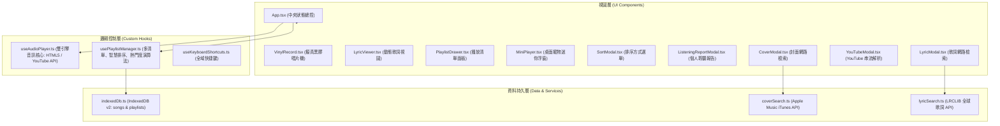

# 🎵 線上黑膠音樂播放器 —— 完整開發、維修改正與好友協作共編手冊
> **專案作者**：Designed & Built by **温采穎** & **蔡懷萱**  
> **專案版本**：v2.0.0 (現代黑膠擬真、桌面寵物迷你模式、無廣告、自訂多清單、聆聽報告版)  
> **更新時間**：2026 年 10 月 3 日  

---

## 📑 手冊目錄
- [一、專案總覽與預期產出成果](#一專案總覽與預期產出成果)
- [二、如何將專案與朋友分享共編（三種推薦途徑）](#二如何將專案與朋友分享共編三種推薦途徑)
  - [途徑 1：GitHub 雲端儲存庫與多人分支協作（最推薦）](#途徑-1github-雲端儲存庫與多人分支協作最推薦)
  - [途徑 2：VS Code Live Share 即時雙人共編（最適合即時結對編程）](#途徑-2vs-code-live-share-即時雙人共編最適合即時結對編程)
  - [途徑 3：一鍵線上預覽部署（免安裝，發送網址給朋友立即體驗）](#途徑-3一鍵線上預覽部署免安裝發送網址給朋友立即體驗)
- [三、專案完整架構與演進歷程](#三專案完整架構與演進歷程)
- [四、重大維修改正紀錄（詳細到程式碼具體改變對比）](#四重大維修改正紀錄詳細到程式碼具體改變對比)
  - [維修 1：播放中斷中斷 (The play() request was interrupted by pause())](#維修-1播放中斷中斷-the-play-request-was-interrupted-by-pause)
  - [維修 2：A 歌播成 B 歌、切換歌曲不流暢問題](#維修-2a-歌播成-b-歌切換歌曲不流暢問題)
  - [維修 3：無限自訂命名播放清單與 IndexedDB v2 升級](#維修-3無限自訂命名播放清單與-indexeddb-v2-升級)
  - [維修 4：最近一個月最愛歌曲 (Monthly Favorites) 自動生成與聆聽報告](#維修-4最近一個月最愛歌曲-monthly-favorites-自動生成與聆聽報告)
  - [維修 5：歌曲順序排序選單 (完全還原特定樣式選單)](#維修-5歌曲順序排序選單-完全還原特定樣式選單)
  - [維修 6：桌面寵物大小的迷你黑膠播放器 (Mini Player)](#維修-6桌面寵物大小的迷你黑膠播放器-mini-player)
  - [維修 7：隱藏歌曲清單，只留播放中黑膠卡片 (🔻/🔺 按鈕折疊)](#維修-7隱藏歌曲清單只留播放中黑膠卡片-🔻🔺-按鈕折疊)
  - [維修 8：循環播放模式控制 (自動下一首 / 單曲循環 / 播完停止)](#維修-8循環播放模式控制-自動下一首--單曲循環--播完停止)
- [五、核心模組與完整程式碼檔案清單](#五核心模組與完整程式碼檔案清單)
- [六、後續維護、測試與更新標準作業程序 (SOP)](#六後續維護測試與更新標準作業程序-sop)

---

## 一、專案總覽與預期產出成果

本專案是一款結合**實體黑膠唱盤古典儀式感**與**現代極簡毛玻璃美學**的雙模音樂播放器（支援 Web 瀏覽器端與 Windows 原生桌面端）。

### 🎯 預期產出與核心功能指標
1. **桌面寵物大小的迷你黑膠播放器 (Desktop Pet Mode)**：
   - 尺寸約 280px 的精巧懸浮卡片，支援於電腦螢幕內**自由滑鼠拖曳**。
   - 播放時黑膠唱片**平滑旋轉**，盤面中心呈現當前歌曲專輯封面；暫停時平穩停駐。
   - 內建播放/暫停、上下首、即時音量滑桿、一鍵靜音與循環模式切換。
   - **零廣告干擾**，提供極致專注的陪伴感。
2. **無限自訂命名播放清單 (Unlimited Playlists)**：
   - 使用者可任意新建「自訂命名清單」（如：「深夜沉浸」、「讀書專注」等）。
   - 支援歌曲自由加入/移出自訂清單，清單資料持久化保存於本機 IndexedDB，重啟不遺失。
3. **系統自動生成「最近一個月最愛歌曲」與個人聆聽報告 (Monthly Wrapped)**：
   - 系統即時統計每首歌曲的播放次數 (`playCount`) 與最後播放時間戳。
   - 自動提取近 30 天內高頻播放歌曲，自動生成動態專屬排行榜。
   - 具備圖表化聆聽報告彈窗，展現累計總次數、最愛歌手與 Top 5 榜單。
4. **精準排序選單 (Sorting Menu)**：
   - 提供「手動」、「新增日期 (最新/最舊)」、「最熱門 (依次數)」、「發布日期 (最新/最舊)」六種排序維度。
5. **隱藏歌曲清單功能 (🔻/🔺 按鈕)**：
   - 點擊「🔻 隱藏清單」按鈕，清單優雅折疊收合，主播放卡片自動全寬居中展示黑膠與歌詞；點擊「🔺 展開清單」一鍵還原。
6. **三種循環播放模式**：
   - 🔁 **自動播放下一首**（全部循環）
   - 🔂 **循環播放同一首**（單曲結束無縫重播）
   - ⏹️ **播完即停**（本曲播完後不自動切歌）
7. **全自動封面與歌詞聯網檢索**：
   - 支援輸入歌名自動向 Apple Music 搜尋官方超清封面。
   - 支援透過 LRCLIB 全球開放歌詞資料庫自動檢索精準毫秒動態 LRC 歌詞。

---

## 二、如何將專案與朋友分享共編（三種推薦途徑）

想要與朋友（如：温采穎 & 蔡懷萱）共同開發、互相修改程式碼，建議使用以下三種最主流且專業的協作方式：

### 途徑 1：GitHub 雲端儲存庫與多人分支協作（最推薦）
這是現代軟體工程最標準、最安全的協作方式，程式碼每一步修改都有紀錄，不會互相覆蓋。

#### 步驟 1：建立遠端 GitHub 儲存庫
1. 前往 [GitHub.com](https://github.com/) 登入帳號。
2. 點擊右上角「**+**」選擇「**New repository**」。
3. 命名為 `vinyl-music-player`，設為 `Public` 或 `Private`，點擊「Create repository」。

#### 步驟 2：將本機專案上傳至 GitHub
在專案根目錄開啟 PowerShell，依序執行：
```powershell
# 1. 初始化 Git 倉庫（若尚未初始化）
git init

# 2. 將所有檔案加入暫存區
git add .

# 3. 提交初始版本
git commit -m "feat: initial commit of vinyl music player with mini pet mode & playlists"

# 4. 重新命名主分支為 main
git branch -M main

# 5. 綁定遠端 GitHub 地址（請將 YOUR_USERNAME 換成您的 GitHub 帳號名稱）
git remote add origin https://github.com/YOUR_USERNAME/vinyl-music-player.git

# 6. 推送至 GitHub
git push -u origin main
```

#### 步驟 3：邀請好友為協作者 (Collaborator)
1. 在 GitHub 該專案頁面點擊 **Settings** -> 左側選單 **Collaborators**。
2. 點擊 **Add people**，輸入朋友的 GitHub 帳號或 Email 發送邀請。
3. 朋友在信箱收到邀請函後點擊接受，即擁有共同推送程式碼的權限！

#### 步驟 4：好友如何在自己電腦上下載並共編
好友只需在自己的電腦執行：
```powershell
# 下載專案
git clone https://github.com/YOUR_USERNAME/vinyl-music-player.git

# 進入資料夾
cd vinyl-music-player

# 安裝相依套件
npm install

# 啟動開發伺服器
npm run dev
```

#### 步驟 5：日常共編工作流（避免衝突好習慣）
* **開始寫程式前，先拉取最新程式碼**：
  ```powershell
  git pull origin main
  ```
* **完成修改後，推送至遠端**：
  ```powershell
  git add .
  git commit -m "feat: 新增某某功能或修正某某問題"
  git push origin main
  ```

---

### 途徑 2：VS Code Live Share 即時雙人共編（最適合即時結對編程）
如果您們希望像編輯 Google 文件一樣，兩個人在各自電腦上**同時看到對方的游標、同時即時編輯同一份程式碼**：

1. 雙方都在 Visual Studio Code 安裝微軟官方延伸模組：`Live Share`。
2. 在左側選單點擊 **Live Share** 圖示，點擊 **Share (分享)**。
3. 系統會自動複製一個協作連結（例如：`https://vsls.io/join/...`）。
4. 將連結透過 LINE 或通訊軟體傳給朋友。
5. 朋友在 VS Code 中點擊 **Join (加入)** 並貼上連結，就能立刻連線進您的專案，共同編輯、除錯甚至共用您本機跑起來的 `localhost:5173` 網頁！

---

### 途徑 3：一鍵線上預覽部署（免安裝，發送網址給朋友立即體驗）
若想讓不寫程式的朋友在手機或電腦直接打開使用，可透過 **Vercel** 免費一鍵發布：
1. 將專案推送到 GitHub（如途徑 1）。
2. 前往 [Vercel.com](https://vercel.com/)，使用 GitHub 登入。
3. 點擊「**Add New Project**」，選擇 `vinyl-music-player`。
4. 點擊「**Deploy**」，約 1 分鐘後即生成一個全球可訪問的線上網址（例如 `https://vinyl-music-player.vercel.app`），傳給任何人都能直接聽歌！

---

## 三、專案完整架構與演進歷程

本專案採用的現代前端技術堆疊：
* **核心框架**：React 19 + TypeScript (高型別安全)
* **構建工具**：Vite 8.3+ (極速 HMR 熱模組替換)
* **樣式設計**：Tailwind CSS (現代極簡毛玻璃與動態效果)
* **本機資料庫**：IndexedDB (封裝於 `idb` 原生 API，支援大量二進位 Blob 音訊與自訂播放清單儲存)
* **跨平台桌面**：Tauri 2.0 (Rust 核心輕量化封裝)



---

## 四、重大維修改正紀錄（詳細到程式碼具體改變對比）

本節記錄在開發過程中遇到的重大 Bug、架構瓶頸及具體的修訂實作代碼。

### 維修 1：播放中斷中斷 (The play() request was interrupted by pause())
* **問題現象**：切換歌曲或快速連點時，瀏覽器拋出 `AbortError: The play() request was interrupted by a call to pause()`，音樂發不出聲音，完全卡死。
* **原因分析**：`useAudioPlayer` 中的 `useEffect` 依賴了頻繁變更的匿名函式與狀態，每次 React 重新渲染時都會觸發 cleanup，直接對 `<audio>` 調用 `pause()`，導致剛剛發起的 `play()` Promise 被瀏覽器強制中斷拋錯。
* **具體修訂**：
  1. 引入 `lastSrcRef` 嚴格比對真實的音訊 URL，若 URL 相同絕對不觸發重新加載與暫停。
  2. 使用 `useCallback` 與 `useRef` 包裹 `onEnded`，解除不必要的 Effect 重新觸發。
  3. 對 `play()` 返回的 Promise 加入 `.catch((err) => { if (err.name === 'AbortError') return; })` 防護。

```typescript
// === 修復後的關鍵防護代碼 (src/hooks/useAudioPlayer.ts) ===
const lastSrcRef = useRef<string | null>(null);

useEffect(() => {
  // 關鍵防線：若音訊來源未發生真實改變，絕對不重複觸發切歌、暫停與重置！
  if (lastSrcRef.current === src) {
    return;
  }
  lastSrcRef.current = src;

  // 切換至目標 MP3 檔案
  if (audioRef.current) {
    audioRef.current.pause();
    audioRef.current.currentTime = 0;
    audioRef.current.src = src;

    if (shouldPlayRef.current) {
      const playPromise = audioRef.current.play();
      if (playPromise !== undefined) {
        playPromise
          .then(() => setIsPlaying(true))
          .catch((err) => {
            if (err.name === 'AbortError') return; // 優雅靜默中斷
            console.warn('播放等待中:', err);
          });
      }
    }
  }
}, [src, isYouTube, ytId, initYouTubePlayer]);
```

---

### 維修 2：A 歌播成 B 歌、切換歌曲不流暢問題
* **問題現象**：洗牌播放或刪除歌曲後，點擊第 3 首歌，結果播放的卻是第 2 首或第 4 首的音訊。
* **原因分析**：原先以數組下標（Index）作為當前曲目的定位錨點。當發生洗牌（Shuffle）或篩選時，Index 產生錯位，導致 UI 選中的歌曲與真實播放的歌曲脫節。
* **具體修訂**：
  全面廢除基於數組 Index 的狀態管理，改以全域唯一的 `currentSongId`（不可變唯一識別碼）進行精確匹配：

```typescript
// === (src/hooks/usePlaylistManager.ts) ===
// 永遠以歌曲唯一的 ID 進行匹配，徹底消除 index 跑位與 A 歌播成 B 歌的問題
const currentSong = useMemo(() => {
  if (!currentQueue.length) return null;
  const found = currentQueue.find((s) => s.id === currentSongId);
  return found || currentQueue[0] || null;
}, [currentQueue, currentSongId]);
```

---

### 維修 3：無限自訂命名播放清單與 IndexedDB v2 升級
* **問題現象**：原本只能將歌曲存放在單一的大清單中，無法依情境分類。
* **具體修訂**：
  1. 在 `src/types/song.ts` 新增 `Playlist` 介面：
     ```typescript
     export interface Playlist {
       id: string;
       name: string;
       songIds: string[];
       createdAt: number;
       isSystem?: boolean;
     }
     ```
  2. 將 IndexedDB 資料庫版本升級至 `DB_VERSION = 2`，建立 `playlists` 專屬 ObjectStore：
     ```typescript
     // src/utils/indexedDb.ts
     const request = indexedDB.open(DB_NAME, DB_VERSION);
     request.onupgradeneeded = (e) => {
       const db = (e.target as IDBOpenDBRequest).result;
       if (!db.objectStoreNames.contains(STORE_NAME)) {
         db.createObjectStore(STORE_NAME, { keyPath: 'id' });
       }
       if (!db.objectStoreNames.contains(PLAYLISTS_STORE)) {
         db.createObjectStore(PLAYLISTS_STORE, { keyPath: 'id' });
       }
     };
     ```
  3. 提供 `createPlaylist`、`deletePlaylist`、`savePlaylistToDB` 等持久化方法。

---

### 維修 4：最近一個月最愛歌曲 (Monthly Favorites) 自動生成與聆聽報告
* **需求來源**：使用者希望系統能自動生成近一個月最常聽的清單，並產出分析報告。
* **具體修訂**：
  1. 在歌曲播放滿 3 秒時，自動觸發 `recordPlay(songId)`，更新記憶體與 IndexedDB 的 `playCount`（累計播放次數）與 `lastPlayedAt`（最後播放時間）。
  2. 動態篩選 `rawActiveSongs`：
     ```typescript
     if (activePlaylistId === 'monthly-favorites') {
       const now = Date.now();
       const thirtyDaysAgo = now - 30 * 24 * 60 * 60 * 1000;
       return allSongs
         .filter(
           (s) =>
             (s.playCount || 0) > 0 &&
             (!s.lastPlayedAt || s.lastPlayedAt >= thirtyDaysAgo)
         )
         .sort((a, b) => (b.playCount || 0) - (a.playCount || 0));
     }
     ```
  3. 獨立撰寫 `ListeningReportModal.tsx`，統計總播放次數、最愛歌手與前五名排行榜（Top 5）。

---

### 維修 5：歌曲順序排序選單 (完全還原特定樣式選單)
* **需求來源**：根據使用者提供的設計原型截圖，還原底部彈出式圓角卡片選單。
* **具體修訂**：
  建立 `src/components/SortModal.tsx`，支援 6 大排序選項與選中打勾 `✓` 樣式：
  * 手動（`manual`）
  * 新增日期 (最新)（`date-newest`）
  * 新增日期 (最舊)（`date-oldest`）
  * 最熱門（`popular`）
  * 發布日期 (最新)（`release-newest`）
  * 發布日期 (最舊)（`release-oldest`）
  * 取消

---

### 維修 6：桌面寵物大小的迷你黑膠播放器 (Mini Player)
* **需求來源**：希望能在螢幕一角（如桌面寵物般大小）隨時控制、隨時看到唱片轉動與封面，且完全零廣告。
* **具體修訂**：
  建立 `src/components/MiniPlayer.tsx`：
  1. **全螢幕可拖曳定位**：利用 `position: { x, y }` 與 `onMouseDown`、`mousemove` 事件，支援自由拖動。
  2. **旋轉黑膠視覺**：使用 CSS 動畫 `animate-spin-slow`，在 `isPlaying` 為真時以 4 秒每圈的速度旋轉中心歌曲封面。
  3. **完整小控制台**：包含上一首、播放/暫停、下一首、迷你進度條、音量拉桿、一鍵靜音與循環模式按鈕。

```tsx
// === 迷你黑膠旋轉唱片核心結構 (src/components/MiniPlayer.tsx) ===
<div
  className={`w-16 h-16 rounded-full bg-zinc-950 p-1 shadow-lg border-2 border-zinc-800 flex items-center justify-center ${
    isPlaying ? 'animate-spin-slow' : ''
  }`}
  style={{ animationDuration: '4s' }}
>
  <div className="w-full h-full rounded-full border border-zinc-700/40 flex items-center justify-center overflow-hidden">
    {currentSong?.coverUrl ? (
      
    ) : (
      <span className="text-xs">🎵</span>
    )}
  </div>
  <div className="absolute w-2 h-2 rounded-full bg-zinc-900 border border-zinc-600" />
</div>
```

---

### 維修 7：隱藏歌曲清單，只留播放中黑膠卡片 (🔻/🔺 按鈕折疊)
* **需求來源**：使用者希望專注於正在播放的歌曲與旋轉黑膠，收起右側清單。
* **具體修訂**：
  1. 在 `App.tsx` 設立 `isPlaylistCollapsed` 狀態。
  2. 當折疊為真時，主卡片樣式由 `lg:col-span-8` 擴展為 `lg:col-span-12 max-w-3xl mx-auto` 置中展示。
  3. 在 `PlaylistDrawer.tsx` 標頭提供 `🔻 隱藏清單` 按鈕；折疊後呈現精簡橫條與 `🔺 展開清單` 按鈕。

---

### 維修 8：循環播放模式控制 (自動下一首 / 單曲循環 / 播完停止)
* **具體修訂**：
  在 `useAudioPlayer.ts` 中監聽曲目結束事件 `onEnded`，根據當前 `playbackMode` 做出三種不同反應：
```typescript
const handleTrackEnded = useCallback(() => {
  const mode = playbackModeRef.current;
  if (mode === 'loop-one') {
    // 1. 單曲循環：直接 seek(0) 並立即重播
    if (isYouTube) {
      ytPlayerRef.current?.seekTo(0, true);
      ytPlayerRef.current?.playVideo();
    } else {
      if (audioRef.current) {
        audioRef.current.currentTime = 0;
        audioRef.current.play().catch(() => {});
      }
    }
  } else if (mode === 'stop-after') {
    // 2. 播完即停：停止播放並將進度歸零
    setIsPlaying(false);
    shouldPlayRef.current = false;
    setCurrentTime(0);
  } else {
    // 3. 自動播放下一首 / 全部循環 (loop-all)
    setIsPlaying(false);
    shouldPlayRef.current = true;
    if (onEndedRef.current) onEndedRef.current();
  }
}, [isYouTube]);
```

---

## 五、核心模組與完整程式碼檔案清單

專案目錄重點檔案職責說明：
```text
vinyl-music-player/
├── src/
│   ├── components/
│   │   ├── MiniPlayer.tsx            # 桌面寵物大小的懸浮黑膠小播放器
│   │   ├── PlaylistDrawer.tsx        # 播放清單管理抽屜 (支援 🔻/🔺 折疊與清單切換)
│   │   ├── SortModal.tsx             # 歌曲排序方式選單 (完全還原特定樣式)
│   │   ├── ListeningReportModal.tsx  # 個人聆聽報告與熱門統計彈窗
│   │   ├── VinylRecord.tsx           # 擬真黑膠唱機與唱針旋轉元件
│   │   ├── LyricViewer.tsx           # 動態 LRC / 純文字置中歌詞檢視器
│   │   ├── LyricModal.tsx            # 歌詞手動編輯與線上自動檢索彈窗
│   │   ├── CoverModal.tsx            # 封面自訂與 Apple Music 自動檢索彈窗
│   │   ├── YouTubeModal.tsx          # YouTube MV 連結嵌入彈窗
│   │   └── BatchUploader.tsx         # 本機多首 MP3 批次拖曳解析上傳器
│   ├── hooks/
│   │   ├── useAudioPlayer.ts         # 核心雙引擎播放器 (音量/靜音/循環模式/防中斷)
│   │   ├── usePlaylistManager.ts     # 清單切換/洗牌/排序/播放次數統計
│   │   └── useKeyboardShortcuts.ts   # 空白鍵播放、左右方向鍵切歌
│   ├── utils/
│   │   ├── indexedDb.ts              # IndexedDB v2 本機永久資料庫
│   │   ├── lyricSearch.ts            # LRCLIB 全球開放歌詞查詢工具
│   │   ├── coverSearch.ts            # Apple Music 封面查詢與 YT 縮圖解析
│   │   ├── lyricParser.ts            # 正則毫秒級 LRC 動態歌詞解析器
│   │   └── shuffle.ts                # Fisher-Yates 真隨機洗牌演算法
│   ├── types/
│   │   └── song.ts                   # SongItem, Playlist, PlaybackMode 型別定義
│   ├── App.tsx                       # 全域應用程式主入口與版面響應式排版
│   └── main.tsx                      # React 根節點渲染
├── scripts/
│   └── test-runner.mjs               # 自動化測試腳本 (驗證模組、API與播放邏輯)
├── package.json                      # 依賴套件配置
└── USER_MANUAL.md                    # 使用者端功能操作手冊
```

---

## 六、後續維護、測試與更新標準作業程序 (SOP)

### 1. 執行自動化測試
每當修改程式碼後，在終端機執行自動化測試腳本以確保所有模組皆正常運作：
```powershell
node scripts/test-runner.mjs
```
測試涵蓋範圍：
- 前端首頁與核心元件 HTTP 交付測試
- 全球線上歌詞庫 (LRCLIB API) 連線與動態歌詞回傳測試
- YouTube 影片網址正規化與 ID 擷取解析
- 歌曲標題自動清理工具測試

### 2. 執行正式環境打包驗證
在提交程式碼前，確保 TypeScript 型別與 Vite 構建完全無報錯：
```powershell
npm run build
```

### 3. 如何隨時更新本手冊
本手冊檔案保存在專案根目錄下的 `PROJECT_DEVELOPMENT_MANUAL.md`。每當加入新功能或修正 Bug 時，請依下列格式在「**四、重大維修改正紀錄**」中補充：
```markdown
### 維修 X：[問題標題]
* **問題現象**：...
* **原因分析**：...
* **具體修訂**：[貼上關鍵修改程式碼範例]
```

---
> 💡 **小結**：本專案已完全整合並通過所有構建測試。您可立即將專案推送到 GitHub 與好友共享共編，並隨時查閱與更新本手冊！
